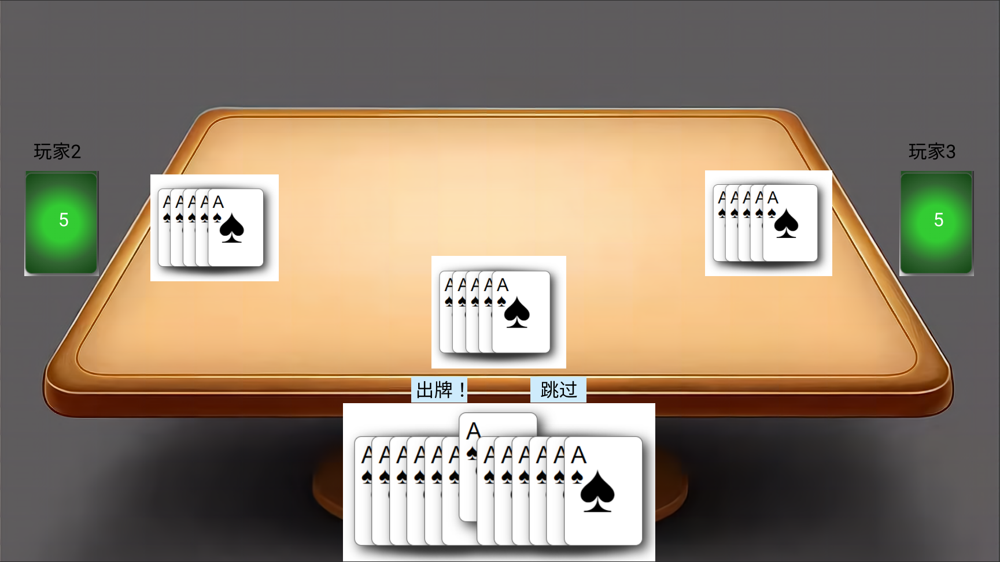
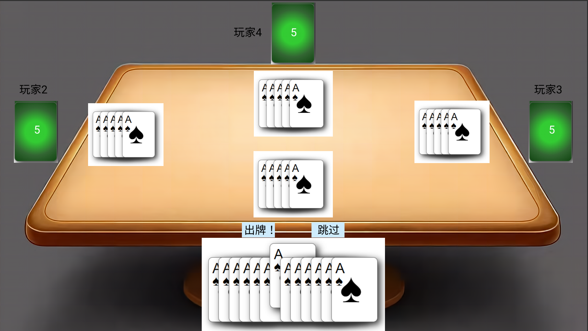
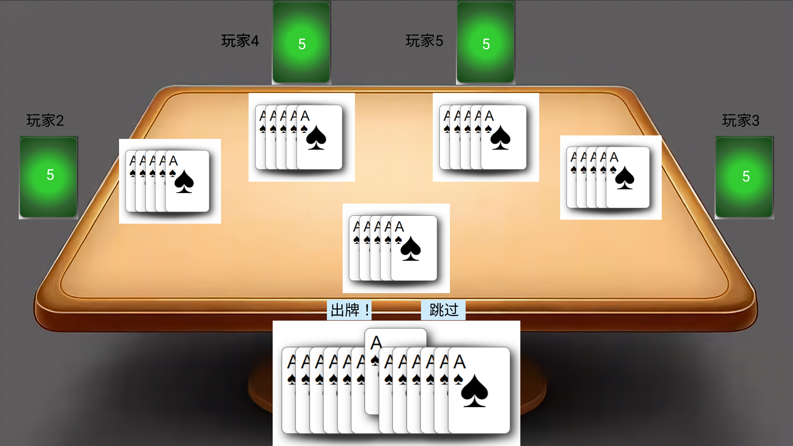
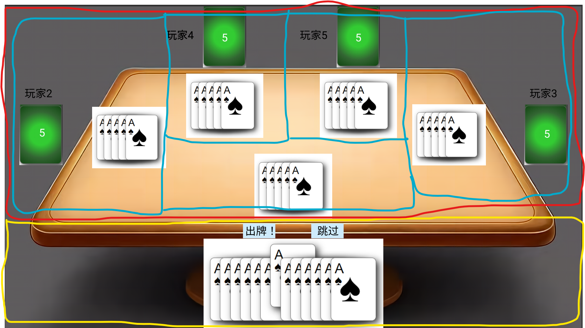

# Main Game Canvas
The layout of the players may be different depending on the number of the players present. 

- 3 Player

- 4 Player

- 5 Player

## Dividing The UI Components
The canvas may be divided (very xD) roughly into the following components:

### Player Control Region
- This is the region in yellow
- This region consists the cards the current player has (together with the animation) as well as buttons for submitting cards

### Players Display Region
- This is the region in red
- This region consists of the info of all the other players

### Player Info Region
- This is the region(s) in blue
- Each region consists of the info of a single player:
    - player name
    - number of remaining cards
    - cards last played

## Important Components

### PlayingCards
- receives as parameter a list of card ids and a boolean flag on whether it should be interactive
- displays the corresponding css card styles
- contains the animation for when user selects a card or hover over it based on the flag value
- should be used in Player Control Region and Player Display region

### ButtonContainer
- a region containing all the buttons needed for client interaction
- should offer the following combinations of buttons based on the current state of the application

|Phase|Buttons|
|---|---|
|Default|`empty`|
|Playing|"Play Card" and "Skip"|
|Returning Tribute|"Submit"|
|Ace Go Public|"Go Public" and "Skip"|
|End of Game|"Ready"|
